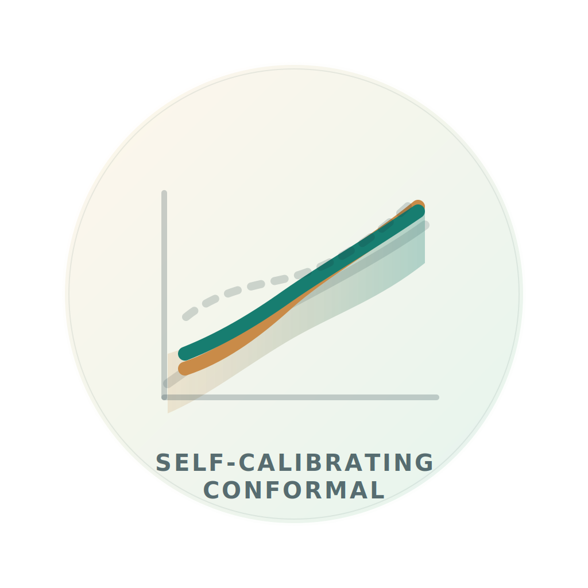

---
hide:
  - navigation
  - toc
---

  <header class="landing-hero">
    <nav class="landing-topbar" aria-label="Section navigation">
      
<a href="#top">selfcalibratingconformal</a>

      

        <a href="#overview">Overview</a>
        <a href="#workflows">Workflows</a>
        <a href="#why-calibration">Why Calibration</a>
        <a href="#install">Install</a>
        <a href="#quickstart">Quickstart</a>
        <a href="#resources">Resources</a>
        <a href="#references">References</a>
        <a href="https://github.com/Larsvanderlaan/SelfCalibratingConformal">GitHub</a>
      

    </nav>

    

      <section class="hero-copy">
        
selfcalibratingconformal

        

          <h1>Calibrated regression and conformal intervals for black-box models</h1>
          

            
          

        

        

          <code>selfcalibratingconformal</code> brings post-hoc calibration and conformal
          prediction to black-box regression models. It supports two routes: calibrate a point
          prediction directly, or calibrate a conformity-score threshold and use that threshold to
          form an interval.
        

        

          <a class="landing-button landing-button-primary" href="#quickstart">Quickstart</a>
          <a class="landing-button landing-button-secondary" href="#workflows">Choose a workflow</a>
          <a
            class="landing-button landing-button-secondary"
            href="https://github.com/Larsvanderlaan/SelfCalibratingConformal"
          >
            GitHub
          </a>
        

        <ul class="hero-pills">
          <li>Point-prediction and score-threshold workflows</li>
          <li>Intervals built from calibrated outputs</li>
          <li>Backward-compatible API with typed configs</li>
        </ul>
      </section>

      <aside class="hero-panel">
        

          
At a glance

          

            

              <strong>Core use case</strong>
              Start from an existing regression model and improve the scale used for reported predictions and intervals.
            

            

              <strong>Two entrypoints</strong>
              Choose between direct calibration of predicted responses and calibration of score thresholds.
            

            

              <strong>Outputs</strong>
              Return calibrated predictions, prediction intervals, and diagnostics for interval quality.
            

          

        

        

          
Core classes

          <pre class="landing-code"><code>from selfcalibratingconformal import (
    SelfCalibratingConformalPredictor,
    VennAbersQuantileConformalPredictor,
)</code></pre>
        

      </aside>
    

  </header>

  <section class="landing-section" id="overview">
    

      
Overview

      <h2>What the package is for</h2>
      

        Use the package when you already have a useful regression model but need better calibration
        and interval construction. It wraps the fitted learner with post-hoc calibration and
        conformal logic, so the original model can remain a black box.
      

    

    

      <article class="landing-card">
        
Self-calibrating conformal

        <h3>Calibrate the predicted response, then build an interval around it</h3>
        

          This workflow starts with a point prediction for <code>y</code>. It learns a monotone
          correction from predicted values to observed outcomes on a calibration set, then builds
          intervals from the calibrated prediction.
        

      </article>
      <article class="landing-card">
        
Quantile workflow

        <h3>Predict how large the error can be, then calibrate that threshold</h3>
        

          This workflow starts with a model for the <code>(1 - alpha)</code> quantile of a
          conformity score. The package calibrates that threshold and then includes candidate
          outcomes whose scores fall below the calibrated cutoff.
        

      </article>
      <article class="landing-card">
        
Conformity score

        <h3>Measure how compatible a candidate outcome is with the input</h3>
        

          A conformity score is a number that is small when a candidate outcome looks plausible and
          large when it looks implausible. The default score is <code>|y - mu(x)|</code>, the
          absolute distance between the candidate outcome and a center prediction.
        

      </article>
    

  </section>

  <section class="landing-section" id="workflows">
    

      
Workflows

      <h2>Choose the workflow that matches your upstream model</h2>
      

        Choose the regression path when you start from a point predictor, and the quantile path
        when you start from a score-threshold model.
      

    

    

      

        <button class="tab-button is-active" type="button" data-workflow="regression">Regression workflow</button>
        <button class="tab-button" type="button" data-workflow="quantile">Quantile-score workflow</button>
      

      

        

          Default starting point
          <h3 data-workflow-title><code>SelfCalibratingConformalPredictor</code></h3>
        

        

          Start here when you have a point predictor for <code>y</code> and want calibrated
          predictions together with intervals derived from that calibrated scale.
        

        

          

            When to use it
            

              Best for the shortest path from a fitted regression model to calibrated predictions
              and interval outputs.
            

          

          

            
predictor

            

            
calibration map

            

            
intervals

          

        

        

          <article class="argument-card">
            <h3 data-workflow-input-title>Core inputs</h3>
            

              A predictor for <code>y</code>, a calibration split, and the target miscoverage
              level <code>alpha</code>.
            

          </article>
          <article class="argument-card">
            <h3 data-workflow-output-title>What you get</h3>
            

              Calibrated point predictions, Venn-Abers style prediction sets, intervals, and
              empirical coverage summaries.
            

          </article>
        

        <pre class="landing-code" data-workflow-code><code>from selfcalibratingconformal import SelfCalibratingConformalPredictor

model = SelfCalibratingConformalPredictor(predictor)
model.fit(X_cal, y_cal, alpha=0.1)
intervals = model.predict_interval(X_test)</code></pre>
      

    

  </section>

  <section class="landing-section" id="why-calibration">
    

      
Why Calibration

      <h2>Predict, calibrate, then form the interval</h2>
      

        The model provides a raw prediction or score threshold, calibration adjusts that quantity
        on held-out data, and the interval is built from the calibrated result.
      

    

    

      <article class="process-step">
        
Step 1

        <h3>Predict</h3>
        
Fit or supply a model that outputs either a response prediction or a score threshold.

      </article>
      

      <article class="process-step process-step-accent">
        
Step 2

        <h3>Calibrate</h3>
        
Use a calibration set to learn a monotone correction so the reported scale better matches the data.

      </article>
      

      <article class="process-step process-step-warm">
        
Step 3

        <h3>Form intervals</h3>
        
Turn the calibrated prediction or threshold into an interval and check coverage empirically.

      </article>
    

    

      <article class="landing-card">
        
Direct regression path

        <h3>How the self-calibrating path makes an interval</h3>
        

          It calibrates the point prediction and then uses residual-based conformity scores to set
          the interval width around that calibrated center.
        

      </article>
      <article class="landing-card">
        
Score-threshold path

        <h3>How the quantile path makes an interval</h3>
        

          It predicts a threshold for the conformity score, calibrates that threshold, and includes
          outcomes whose scores stay below the calibrated cutoff. With the default absolute-residual
          score, this gives a symmetric interval around the center prediction.
        

      </article>
    

  </section>

  <section class="landing-section" id="install">
    

      
Install

      <h2>Install the package and start from your own predictor</h2>
      

        Most users only need the base package.
      

    

    

      <pre class="landing-code"><code>python -m pip install selfcalibratingconformal</code></pre>
    

  </section>

  <section class="landing-section" id="quickstart">
    

      
Quickstart

      <h2>A compact regression workflow</h2>
      

        The example below fits the regression workflow on a calibration split and then produces
        calibrated intervals on a test set.
      

    

    

      <pre class="landing-code"><code>import numpy as np
from selfcalibratingconformal import SelfCalibratingConformalPredictor

class MeanPredictor:
    def predict(self, x):
        x = np.asarray(x)
        return 1.5 * x[:, 0]

model = SelfCalibratingConformalPredictor(MeanPredictor())
model.fit(X_cal, y_cal, alpha=0.1)
point_predictions = model.predict_point(X_test)
intervals = model.predict_interval(X_test)
coverage, width = model.check_coverage(X_test, y_test)</code></pre>
    

  </section>

  <section class="landing-section" id="resources">
    

      
Resources

      <h2>Documentation and papers</h2>
      

        Use these links for notebooks, API documentation, and the main references behind the two
        workflows.
      

    

    

      <article class="resource-card">
        
Paper PDF

        <h3>Inductive Venn-Abers predictive distribution</h3>
        
Primary reference for the regression-style Venn-Abers workflow.

        <a href="http://proceedings.mlr.press/v91/nouretdinov18a/nouretdinov18a.pdf">Open PDF</a>
      </article>
      <article class="resource-card">
        
Paper PDF

        <h3>Conformalized quantile regression</h3>
        
Primary reference for the quantile-based interval construction.

        <a href="https://papers.nips.cc/paper_files/paper/2019/file/5103c3584b063c431bd12689b5e76fb-Conference.pdf">Open PDF</a>
      </article>
      <article class="resource-card">
        
Notebook

        <h3>Regression quickstart</h3>
        
Example of the direct regression workflow.

        <a href="https://github.com/Larsvanderlaan/SelfCalibratingConformal/blob/master/quickstart_regression.ipynb">Open notebook</a>
      </article>
      <article class="resource-card">
        
Notebook

        <h3>Quantile conformal quickstart</h3>
        
Example of the score-threshold workflow.

        <a href="https://github.com/Larsvanderlaan/SelfCalibratingConformal/blob/master/quickstart_quantile_cp.ipynb">Open notebook</a>
      </article>
      <article class="resource-card">
        
Notebook

        <h3>Advanced customization</h3>
        
Review custom scores, custom calibrators, and solver configuration.

        <a href="https://github.com/Larsvanderlaan/SelfCalibratingConformal/blob/master/advanced_customization.ipynb">Open notebook</a>
      </article>
      <article class="resource-card">
        
Docs

        <h3>API reference</h3>
        
See the public class and config surface.

        <a href="./api/">Open API page</a>
      </article>
      <article class="resource-card">
        
Docs

        <h3>Guides</h3>
        
Short descriptions of the regression and quantile workflows.

        <a href="./guides/">Open guides</a>
      </article>
      <article class="resource-card">
        
Repository

        <h3>README and source</h3>
        
Find installation details and repository context.

        <a href="https://github.com/Larsvanderlaan/SelfCalibratingConformal">Open repository</a>
      </article>
    

  </section>

  <section class="landing-section landing-section-last" id="references">
    

      
References

      <h2>Core background</h2>
      

        The package draws on Venn-Abers predictive distributions and conformalized quantile
        regression.
      

    

    <ul class="reference-list">
      <li>Vovk, V., Petej, I., and Fedorova, V. (2015). <em>Large-scale probabilistic predictors with and without guarantees of validity</em>.</li>
      <li>Angelopoulos, A. N. and Bates, S. (2023). <em>Conformal prediction: A gentle introduction</em>.</li>
      <li>Romano, Y., Patterson, E., and Candes, E. (2019). <em>Conformalized quantile regression</em>.</li>
    </ul>
  </section>

